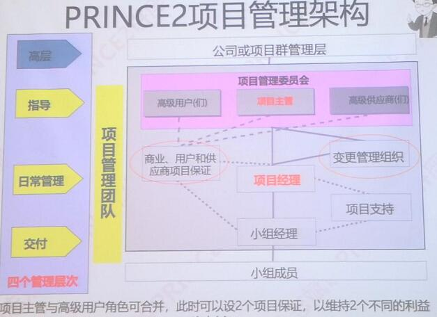
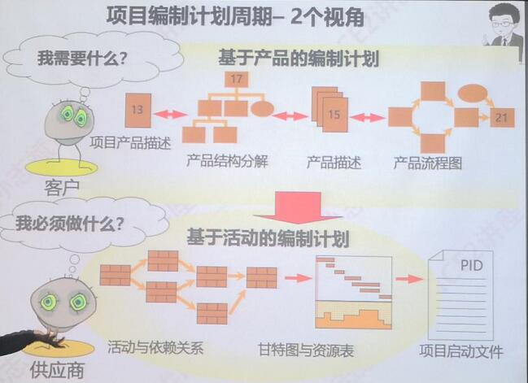
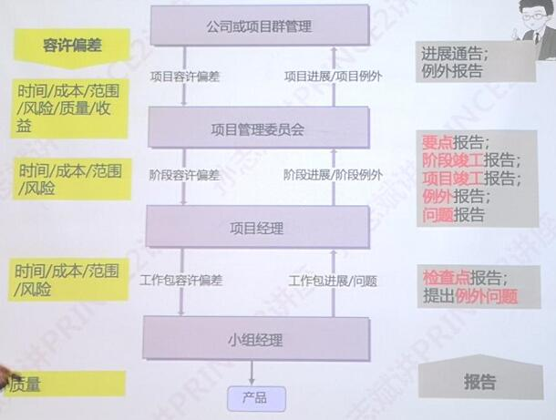
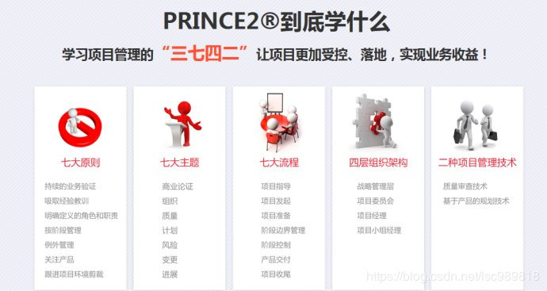

# 一、前提基础：PMP与PRINCE2的认证情况：  

　**PMP（项目管理专业人士资格认证）**是PMI的产品，PMBOK是PMP的认证标准，是事实上的美国项目管理标准，PMI资格成员70%集中在北美，中国在全球认证人数仅次于美国等少数国家，这项成绩源于PMI、国家外国专家局（考试组织单位）及在中国众多REP（注册的教育机构）的10年共同努力。  

　**PRINCE2（受控环境下的项目管理资格认证）**是OGC的产品，是英国项目管理标准，它流行于英国及欧洲、澳大利亚等国家，联合国将其作为项目管理的推荐标准，PRINCE2起源于英国，但它有超过70%的成员是在英国以外的国家，有超过150个国家和地区都在使用与推广PRINCE2，全球有超过40万人获得此项认证，它被誉为世界500强企业首选的项目管理方法论。

# 二、学完PMP能实操么？：很难

　学完PMP，很难在实际项目中应用PMP知识，因为**学习的是PMBOOK指南，而指南最主要的作用是统一话术，即告诉应该做什么东西，但没有告诉你应该怎么做事情**，学完PMP会产生很多的疑问，例如：           

   - **只有十大知识领域，但是却没有实操流程**：
	  - 即只知道要做什么，却不知道该怎么做
  - **商业论证分析与管理的过于简略**：
	  - PMP 只在制定项目章程时提到了需要有商业论证，PRINCE2 则进行了详细的展开
  - **项目经理担大责有小权**：
	  - PMP 中的项目组织形式默认是矩阵型，没有明确角色和职责，即只能看做是PRINCE2中交付层的项目管理内容
	  - PRINCE2 中明确了角色与职责，从而明确了**权责利**的关系，即PRINCE2中的管理，是比PMP的更高LEVEL的管理
  - **只针对项目经理本人**：
	  - PMP： 更注重项目经理，一个优秀的项目经理应该具备的知识水平和多年的项目经验，注重个体技能的提高和发展。也就是说企业或在项目的绩效取决于项目经理的个人水平
	  - PRINCE2： 在组织环境中明确定位团队的责任、权利和利益，认为好的方法、流程才能带来持续有效的实现目标，并且阶段性验证项目存在的必要性，不断验证商业论证。企业和项目的绩效不依赖于项目经理的个人水平
  - **只有(项目管理过程)ITO**：
	  - PMP告诉你有49个管理过程，但由于没有明确角色和责任，就不知道应该是谁去做和怎么做的问题
  - **只有输出文档**：
	  - PMP中针对文档没有具体的案例模板  

　
　另一方面，PMP指南中也存在很多项目**实战中违背逻辑**的地方，比如：PMP 中**项目资源管理**知识领域中，在**执行过程组**有**获取资源、建设团队、管理团队**三个过程，但是真实的项目实战中，**在项目启动阶段就应该建立好团队了**，因为只有这样，后面才能在规划过程组才能制定计划（不能只有项目经理一个人来制定所有计划）

# 三、PMP VS  PRINCE2: 没有对比，怎么知道PMP 只是个弟弟
### 从侧重点方面对比：
	PMP： 
		• 目标：希望造就一个高效的项目经理
           * 通过理论框架指导，统一话术，指导 what Pm to do   
		• 知识内容：  
		   * 概念，定义，知识体系
		   * 5大过程贯穿，10大知识领域，47个过程
		• 突出强调：
		   * PM 个体知识水平，职业道德，管理技能
		• 优点：
		   * 统一了话术
		   * 有利于个体能力素质有效提升

	PRINTCE2 ： 
		• 目标：希望做成一个高效的项目
           * 通用的实现方法论，一系列具体的流程、步骤等 指导 how PM to do 
		• 知识内容： 
		   * 以业务（B）和项目（P）的整合为主线，指导项目实现收益。
		   * 7大原则，7大主题，7大流程
	    • 突出强调：
		   * 明确组织内的角色和职责，实行分层管理，授权控制和监督
			   * 明确组织内角色/责任：实例讨论
				   * 这也是企业咨询的主要问题点：组织问题：角色不清，职责不明。
				   * 变革本质就是变组织架构，重新进行职权分配，明确角色、职责和权利确认清楚（本色做人，角色做事）
				   * 项目 == 变革，需要认同，认同需要参与，最好的参与就是头脑风暴，通过上层指定outcome，PM来制定具体的output
				   * 运营 则更多的需要服从，按照既定output来完成，通过持续的运营，最终产生benefits 和 disbenefits  
		   * 实现分层管理、授权、控制、监督
				○ 分层：
					§ 交付层：小组经理负责产品交付。（PMP 其实相当于这里的管理）
					§ 管理层：项目经理，只对项目日常管理负责
					§ 指导层：项目管理委员会对项目最终负责
					§ 高层：
				○ 有层级才有授权：实例讨论
				   * 例如出差场景下，大PM 会授权给小PM一些责权，否则是零授权，什么事情都要向大PM 汇报。
		• 优点：
		   * PRINCE2以业务和项目的整合为主线，指导项目实现业务收益。
		   * 明确组织内的角色和职责，实现分层管理，授权，控制和监督，有利于实现微观管理到宏观管理的转化

### 从指导思想上对比：  
	PMP： 
		• 优秀PMer：希望造就一个高效的项目经理
           * PMBOK + 多年的实践经验
           * 好的PMer = 好绩效的Project
           * 注重 个体技能 的提高和发展
        • -> 企业/项目绩效  取决于PM个体水平   

	PRINTCE2 ： 
		• 在组织/环境 中 项目团队  责权利  定位明确
           * 好的方法、流程 = 持续有效  实现项目目标
           * 阶段性验证  项目存在的必要性（商业论证）
       • -> 项目是最有效的执行
       • -> 企业/项目绩效  不依赖于 PM 个体水平

	比如华为的案例

### 从适应局限性上对比：  
	PMP： 
		• 适用于 成熟的 项目管理环境（强矩阵）
           * 适用于项目经理 个体知识、能力、素质水平 较高的环境
           * 缺少从 “收益（benefit）” 的角度来评价项目管理。
           
	PRINTCE2 ： 
		• 注重方法论，不涵盖具体细节的知识 和技术。
           * 假设前提: 是从业人员已经具备了足够的知识和技能，适用于各种规模和复杂程度的项目

### 总结：  
　**PMP 和 PRINCE2的对比**主要为：  

  | 序号 | 维度 | PMP | PRINCE2 |  
  | :------: | :------: | :------:  | :------:  |    
  | 1 | 目标 | 高效项目经理 |  高效项目  |  
  | 2 | 定位 | 指南 |方法论 |  
  | 3 | 侧重 | PM个体能力和素质 | 微观到宏观 |  
  | 4 | 思想 | 能力经验 | 方法流程 |  
  | 5 | 局限 | 缺少收益 | 不涵盖具体知识技术 |  
  | 6 | 责权 | 项目经理有则无权 | 分层分责分权 |  
  | 7 | 认证 | 国内多，国际少 | 国内少，国际多 |    

　**PRINCE2 可以看成是对PMP的补充**    

  | 序号 | PMP欠缺 | PRINCE2补充 |  
  | :------: | :------:  | :------:  |    
  | 1 | 没有流程 |  7大流程下的40个子流程  |  
  | 2 | 缺少收益 | 业务验证原则  + 商业论证主题 |  
  | 3 | 权责不配 | 基于分层的分责 和 分权 |  
  | 4 | 不分层级 | 4个分层（授权的前提） |  
  | 5 | 很难落地 | 每个子流程，每个管理产品都有P.R.A的责任分配（指定计划和其高层的审批） |  
  | 6 | 没有模板 | 附录A都是模板 |  
  

# 四、全局概览下的PRINCE2的:
　**PRINCE2想买个管理架构图**如下图所示，具体PRINCE2的好处分析如下：
   

#### 1. 项目管理委员会： 权责利 明确对应
   PRINCE2中的变更管理组织 类似于 PMP 中的 变更控制委员会 CCB（Change Control Board）

#### 2. 基于商业论证的决策：商业论证主题
	目的： 项目的“合理性”、“可交付”、“可获得”  
	项目主管（业务主管）负责商业论证  
	高级用户： 收益  
	高级供应商：可交付  
　**需要明确几个项目关键性信息**如下：
  
   - 项目的产出  output  ：  
	  - 具体产出
   - 项目的成果  outcome ：  
	  - 指项目带来的改变(不是持续的)
	  - 是专业领导应该给项目的经理的目标，而不应该给PM 设置output，output应该有项目经理来设定，因为只有项目经理才最了解项目。
	  - 不能给项目PM设置 benefit，因为不能确定衡量单个项目带来的benefit
   - 项目的收益  benefit ：(可测量)   
	   - 项目带来的改变持续一段时间，即运营才能产生benefit，也要求了所有的项目要进行评审
	   - 财务收益：市场占有率
	   - 无形收益：品牌影响力
	   - 认识 outcome 和 benefit 的不同：
		   - 体重降低30斤不是 benefit 而是 outcome ，因为这种改变需要持续一段时间，即运营才能产生收益。
		   -  benefit VS value:
			   -   项目是为了创造改变，但是改变是否有收益，是否有价值，是需要运营或者以后再说的，即确定项目是否启动不应该主要看项目收益（项目集管理才看中这个），而更多是项目成果。

   -  商业论证的验证：
	   - 项目经理审核
	   - 项目管理委员会审核
   -   收益的确认（收益评审计划）
	   -项目经理/项目主管/公司或项目群管理层/卓越中心等
		
   -  简单总结：PM（管理层） 启动项目前，先明确上层（指导层）给定的outcome ，然后通过头脑风暴 确定具体的output,而更高层次的benefit 更多的是由更上层（高层，例如战略目标等）来考虑  

####3. 基于产品的规划
  **先有的PBS（产品分解结构）  才有 WBS**，例如**prince2的两个视角**为，详细关系如下图：
  

   - 客户视角：基于产品
   - 供应商视角：如何实现
 
####4. 基于问题管理
  PMP中有问题日志，问题登记册等，他们都是记录性日志，那么**日志和登记册有什么区别**呢？PRINCE2给出了明确的区分：日志是非正式记录的问题，而登记册是正式记录的问题

####5. 容许偏差和例外管理：
 **由于PRINCE2的分层管理**，在授权的时候，不同层次对下层的授权和容许偏差是不相同的，下层根据上层的授权进行问题上报，对权责之前的问题需要提出例外汇报等，详细关系如下图：
 
####6. 变更管理和配置管理：
  **配置  和 变更的区别**呢？ 配置是变更的前提，变化多的项目管理场景下就需要配置管理。
####7. 质量审查技术：略

# 五、讨论下项目管理中的实践经验:
## 问题1：权利和责任：理论上责权匹配，实际上则不是的。为什么现实中，一般都是大责小权？  

 主要有几点：  

   - 大责：意味着为公司挣更多的钱，即充分利用资源（可以看做是成本管理中超卖的意思）
   - 小权：通常并非不信任PM，而是考虑到项目的重要性，权利小，意味着项目对上层更重要，因此授权较小，使得整体项目风险更佳可控。  
   
  总结来说就是，带来更多利益同时项目可控

## 问题2：项目管理的方法论，为什么是原则->主题->流程，你认为项目管理的方法论是什么样的呢？ 

 主要有几点：  

   - 基于原则的管理的好处：原则告诉你不能做什么，更宽泛，也就更灵活。  
   - 主题 则较原则粒度更细，更聚焦于某一领域，可以类比到 PMP 中的10大知识领域  
   - 流程： 粒度最小，也最明确，告诉你该怎么做？
   
  总结来说就是，这种从抽象到逐步聚焦、细化到流程的管理体系的方法论，更适配于各类的项目实战中。

# 六、PRINCE2的只是内容的进一步拓展:
   

   [参考1：PRINCE2学习笔记-泛读1](https://blog.csdn.net/lsc989818/article/details/85650321)